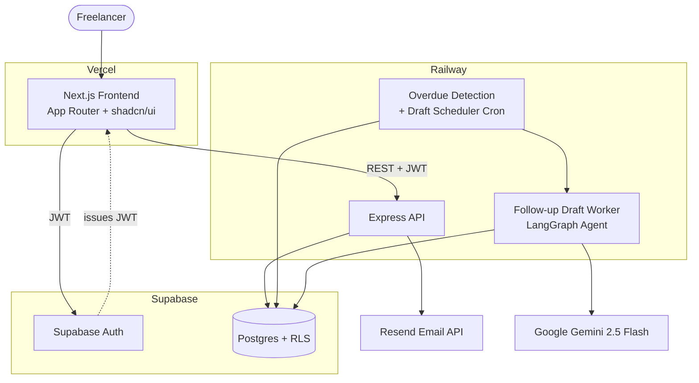
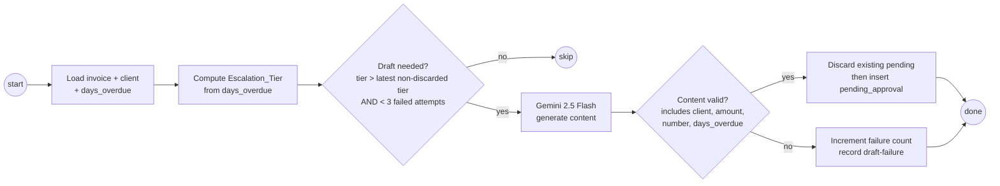
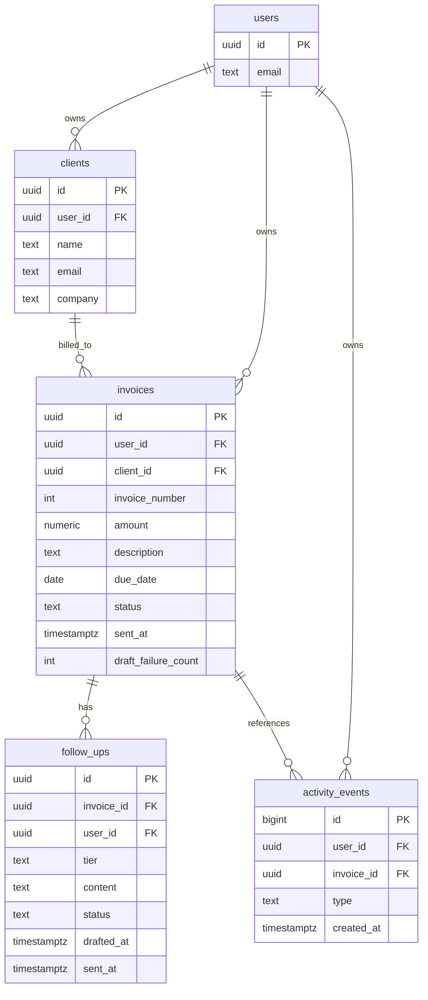

# Design Document

## Overview

PayNudge is a multi-tenant web application that lets solo freelancers and very small agencies create invoices, track payment, and automatically chase overdue invoices with AI-drafted follow-up emails — while keeping a human in control of every outbound message. This document translates the 11 approved requirements into a concrete technical design.

The system is composed of four cooperating tiers plus an AI agent:

- **Frontend** (Next.js App Router on Vercel) — authenticated UI for clients, invoices, dashboard, and follow-up approval.
- **Backend API** (Node.js + Express on Railway) — request handling, validation, invoice numbering, state transitions, and orchestration of the AI agent and email delivery.
- **Database + Auth** (Supabase Postgres + Supabase Auth) — durable storage with per-user Row Level Security (RLS) enforcing data isolation.
- **Email** (Resend) — delivery of invoice emails and approved follow-up emails.
- **AI Agent** (LangGraph JS/TS + Google Gemini 2.5 Flash via `@google/generative-ai`) — evaluates how overdue an invoice is and drafts an escalating follow-up email.

### Key Design Decisions

| Decision | Rationale | Requirements |
|---|---|---|
| Supabase RLS as the primary isolation boundary | Ownership scoping must hold even if application code has a bug; enforcing at the database means every query is filtered by `auth.uid()`. | 1.9, 1.10, 2.11, 3.9, 4.7, 6.5, 9, 11.5, 11.6 |
| Per-user invoice numbering guaranteed at Postgres level | Numbers must restart per user and stay unique under concurrency; application-level read-then-increment is race-prone. | 3.2, 3.3, 3.4 |
| Follow-up drafting as an asynchronous background job | Requirement 8 grants a generous 300s window; async drafting absorbs transient AI latency, retries, and scheduling without blocking a request. | 8.1, 8.8, 8.9 |
| Human-in-the-loop enforced by status gate | Email delivery is only reachable from the `approved` transition, never directly from a draft. | 9.1, 9.5, 9.6 |
| At-most-one pending follow-up enforced by partial unique index | The invariant is a data constraint, not just application logic. | 10.4, 10.5 |
| Scheduled cron job for overdue detection | Requirement 7 needs at-least-daily evaluation independent of user activity. | 7.1–7.7 |

### Technology Stack

- **Frontend:** Next.js (latest, App Router), Tailwind CSS, shadcn/ui, deployed on Vercel.
- **Backend:** Node.js + Express.js, deployed on Railway.
- **Database & Auth:** Supabase (Postgres 15+) with Supabase Auth (JWT sessions).
- **Email:** Resend (`resend` Node SDK).
- **AI:** LangGraph (`@langchain/langgraph`) orchestrating Google Gemini 2.5 Flash through `@google/generative-ai`, authenticated with the `GOOGLE_API_KEY` environment variable (free tier: 1,500 requests/day, no credit card).
- **Scheduling:** Railway cron (or a Node scheduler process) invoking internal jobs.

## Architecture

### System Context



### Request Authentication Flow

1. The frontend authenticates the user with Supabase Auth and receives a JWT.
2. Every API request carries the JWT as a `Bearer` token.
3. The Express API verifies the JWT and creates a per-request Supabase client scoped to the user (using the user's JWT), so all database access runs under that user's RLS context.
4. Background jobs (cron, draft worker) use the Supabase service role but always filter explicitly by `user_id`, since they act on behalf of many users and bypass RLS.

### Component Responsibilities

- **Auth_Service** → Supabase Auth + a Next.js middleware guard that redirects unauthenticated users to `/login` (Req 1).
- **Client_Manager** → `/clients` API + `clients` table (Req 2).
- **Invoice_Manager** → `/invoices` API + `invoices` table + the atomic numbering routine (Req 3, 4, 11).
- **Email_Service** → Resend integration wrapper with timeout + delivery confirmation (Req 4, 9).
- **Payment_Tracker** → `/invoices/:id/pay` transition (Req 6).
- **Overdue_Detector** → daily cron job (Req 7).
- **AI_Agent** → LangGraph draft worker (Req 8, 10).
- **Dashboard / Activity_Feed / History** → read endpoints and the `activity_events` table (Req 5, 11).

### Deployment Boundaries

The frontend never talks to the database directly for mutations; it goes through the Express API so that invoice numbering, state transitions, and the human-in-the-loop gate are centralized and consistently validated. The frontend MAY use the Supabase client directly for auth session management.

## Components and Interfaces

All endpoints require a valid Supabase JWT unless noted. All list/detail endpoints resolve ownership through RLS; a record the user does not own is indistinguishable from a nonexistent record (returns "not available").

### Auth (Req 1)

Handled primarily by Supabase Auth on the frontend. The API trusts the verified JWT `sub` claim as `user_id`.

- Sign-up validation (email format, password 8–128 chars, duplicate email) is enforced by Supabase Auth; the frontend surfaces the returned error messages (Req 1.2–1.4).
- Next.js middleware protects `/dashboard`, `/clients`, `/invoices` routes and redirects to `/login` when no session exists (Req 1.7, 1.8).

### Clients API (Req 2)

| Method | Path | Description |
|---|---|---|
| `POST` | `/clients` | Create client. Validates name (1–200), email format, company (≤200). |
| `GET` | `/clients` | List clients owned by user (empty list if none). |
| `GET` | `/clients/:id` | Get a single owned client. |
| `PUT` | `/clients/:id` | Update owned client with full validation; rejects if not owned. |
| `GET` | `/clients/:id/history` | Client history: all invoices + statuses (Req 11.3, 11.6). |

### Invoices API (Req 3, 4, 6, 11)

| Method | Path | Description |
|---|---|---|
| `POST` | `/invoices` | Create draft invoice; assigns next per-user invoice number atomically. |
| `GET` | `/invoices` | List owned invoices. |
| `GET` | `/invoices/:id` | Get owned invoice (amount, description, due date, number, client, status). |
| `POST` | `/invoices/:id/send` | Send draft invoice via Resend; idempotent per send action. |
| `POST` | `/invoices/:id/pay` | Mark sent/overdue invoice as paid. |
| `GET` | `/invoices/:id/history` | Invoice history + follow-up history (Req 11.1, 11.2, 11.5). |
| `DELETE` | `/invoices/:id` | Delete invoice and cascade-delete its follow-ups (Req 11.7). |

The `send` action uses a short-lived processing lock (a conditional status update, see Error Handling) so concurrent send clicks deliver at most one email (Req 4.8).

### Follow-ups API (Req 9)

| Method | Path | Description |
|---|---|---|
| `GET` | `/follow-ups?status=pending_approval` | List pending follow-ups newest-first with invoice/client context. |
| `PUT` | `/follow-ups/:id/content` | Replace drafted content (non-empty, ≤10,000 chars). |
| `POST` | `/follow-ups/:id/approve` | Approve → triggers Resend delivery → sent. |
| `POST` | `/follow-ups/:id/discard` | Discard a pending follow-up. |

Every follow-up mutation first checks the follow-up is in `pending_approval`; otherwise it returns "not pending approval" and changes nothing (Req 9.11).

### Dashboard API (Req 5)

| Method | Path | Description |
|---|---|---|
| `GET` | `/dashboard` | Returns `outstanding_total`, `overdue_count`, `pending_follow_up_count`, and up to 20 activity events. |

Activity events are ordered by `created_at` descending, tie-broken by `id` descending (Req 5.5).

### Internal Jobs (not user-facing)

- `runOverdueDetection()` — daily cron. Transitions `sent` → `overdue` past due date; recomputes `days_overdue` (Req 7). Enqueues eligible invoices for drafting.
- `draftFollowUp(invoiceId)` — LangGraph worker. Computes tier from `days_overdue`, calls Gemini, writes a `pending_approval` follow-up, handling the at-most-one invariant and retry/failure counting (Req 8, 10).

### AI Agent Flow (LangGraph)



The tier mapping is a pure function of `days_overdue`:

- `1 ≤ days_overdue < 7` → `polite` (Req 8.2)
- `7 ≤ days_overdue < 14` → `firm` (Req 8.3)
- `days_overdue ≥ 14` → `final_notice` (Req 8.4)

The escalation cycle (Req 10.1) only drafts a new follow-up when the current tier is strictly higher than the tier of the most recent non-discarded follow-up, using order `polite < firm < final_notice`.

## Data Models

### Entity Overview



### Postgres Schema

`users` is Supabase Auth's `auth.users`. Application tables live in `public` and reference `auth.uid()`.

```sql
-- CLIENTS
create table public.clients (
  id         uuid primary key default gen_random_uuid(),
  user_id    uuid not null references auth.users(id) on delete cascade,
  name       text not null check (char_length(name) between 1 and 200),
  email      text not null check (position('@' in email) > 1),
  company    text check (company is null or char_length(company) <= 200),
  created_at timestamptz not null default now(),
  updated_at timestamptz not null default now()
);
create index clients_user_id_idx on public.clients(user_id);

-- INVOICES
create table public.invoices (
  id             uuid primary key default gen_random_uuid(),
  user_id        uuid not null references auth.users(id) on delete cascade,
  client_id      uuid not null references public.clients(id),
  invoice_number integer not null check (invoice_number >= 1),
  amount         numeric(12,2) not null check (amount >= 0.01 and amount <= 999999999.99),
  description    text not null check (char_length(description) between 1 and 2000),
  due_date       date not null,
  status         text not null default 'draft'
                   check (status in ('draft','sent','overdue','paid')),
  sent_at        timestamptz,
  draft_failure_count integer not null default 0,
  send_lock_at   timestamptz,          -- processing lock for send idempotency
  created_at     timestamptz not null default now(),
  updated_at     timestamptz not null default now(),
  -- Per-user sequential numbering: hard uniqueness backstop
  constraint invoices_user_number_unique unique (user_id, invoice_number)
);
create index invoices_user_status_idx on public.invoices(user_id, status);
create index invoices_client_idx on public.invoices(client_id);

-- FOLLOW_UPS
create table public.follow_ups (
  id          uuid primary key default gen_random_uuid(),
  invoice_id  uuid not null references public.invoices(id) on delete cascade,
  user_id     uuid not null references auth.users(id) on delete cascade,
  tier        text not null check (tier in ('polite','firm','final_notice')),
  content     text not null check (char_length(content) between 1 and 10000),
  status      text not null default 'pending_approval'
                check (status in ('pending_approval','approved','sent','discarded')),
  drafted_at  timestamptz not null default now(),
  sent_at     timestamptz,
  created_at  timestamptz not null default now()
);
create index follow_ups_invoice_idx on public.follow_ups(invoice_id);
-- At-most-one pending follow-up per invoice (Req 10.4)
create unique index follow_ups_one_pending_per_invoice
  on public.follow_ups(invoice_id)
  where status = 'pending_approval';

-- ACTIVITY_EVENTS
create table public.activity_events (
  id         bigint generated always as identity primary key,
  user_id    uuid not null references auth.users(id) on delete cascade,
  invoice_id uuid references public.invoices(id) on delete cascade,
  type       text not null check (type in ('invoice_sent','follow_up_sent','payment_received')),
  metadata   jsonb not null default '{}'::jsonb,
  created_at timestamptz not null default now()
);
create index activity_events_user_idx
  on public.activity_events(user_id, created_at desc, id desc);
```

Note the `content` length check (1–10,000) mirrors the edit bound in Req 9.3/9.4, and the partial unique index enforces the at-most-one-pending invariant (Req 10.4) at the storage layer rather than relying on application logic alone.

### Row Level Security (per-user isolation)

RLS is enabled on all four tables. Every policy scopes rows to the authenticated user, satisfying Req 1.9, 1.10 and the ownership rejections in Req 2.11, 3.9, 4.7, 6.5, 11.5, 11.6.

```sql
alter table public.clients        enable row level security;
alter table public.invoices       enable row level security;
alter table public.follow_ups     enable row level security;
alter table public.activity_events enable row level security;

create policy clients_owner on public.clients
  for all using (user_id = auth.uid()) with check (user_id = auth.uid());

create policy invoices_owner on public.invoices
  for all using (user_id = auth.uid()) with check (user_id = auth.uid());

create policy follow_ups_owner on public.follow_ups
  for all using (user_id = auth.uid()) with check (user_id = auth.uid());

create policy activity_owner on public.activity_events
  for all using (user_id = auth.uid()) with check (user_id = auth.uid());
```

Because RLS filters at the row level, a request for a record the user does not own returns no rows — the API maps that to a "not available" / "not authorized" response without leaking existence.

### Per-User Sequential Invoice Numbering (Req 3.2, 3.3, 3.4)

This is the concurrency-critical part of the design. The requirements demand invoice numbers that:

- start at 1 for each user's first invoice (3.2),
- increment by one relative to that user's highest existing number (3.3),
- remain unique within a user even under concurrent submissions (3.4).

**Why not a global Postgres `SEQUENCE`?** A single `SEQUENCE` is monotonic across the whole table and cannot restart per user — user B's first invoice would inherit a large number continued from user A. Sequences also never "reset" per partition. Since numbering must restart per user, a global sequence is the wrong tool.

**Why not application-level read-then-increment?** Reading `MAX(invoice_number)` in the app and then inserting `max+1` has a time-of-check-to-time-of-use race: two concurrent requests both read the same max and both try to insert the same number. This is explicitly rejected by the design directive.

**Chosen mechanism — atomic assignment guarded by a unique constraint, with retry-on-conflict.** The hard backstop is the `unique (user_id, invoice_number)` constraint declared above; no path can ever persist a duplicate. On top of that, assignment is performed in a single atomic statement that computes the next number from within the same transaction:

```sql
-- Executed inside the invoice-create transaction.
insert into public.invoices
  (user_id, client_id, invoice_number, amount, description, due_date, status)
select
  $1, $2,
  coalesce(max(invoice_number), 0) + 1,
  $3, $4, $5, 'draft'
from public.invoices
where user_id = $1
returning *;
```

If two concurrent transactions both compute the same `max+1`, the unique constraint causes one to fail with a unique-violation (`23505`). The Invoice_Manager catches `23505` and retries the statement (bounded retry, e.g. up to 5 attempts with small backoff). On retry the losing transaction recomputes a fresh `max+1` and succeeds. This yields per-user gap-tolerant sequential numbers that are always unique.

**Alternative (equivalent) mechanism.** A per-user counter row (`invoice_counters(user_id, next_number)`) locked with `SELECT ... FOR UPDATE` serializes assignment per user:

```sql
-- Inside the create transaction:
insert into public.invoice_counters(user_id, next_number)
  values ($1, 1)
  on conflict (user_id) do nothing;

select next_number from public.invoice_counters
  where user_id = $1 for update;      -- row lock serializes concurrent creators

update public.invoice_counters
  set next_number = next_number + 1
  where user_id = $1;
```

The row lock guarantees serialized, gap-free numbering per user; the `unique (user_id, invoice_number)` constraint remains as the backstop. Either mechanism satisfies 3.4; the primary design uses the retry-on-conflict `INSERT ... SELECT` because it needs no extra table and the unique constraint already provides the correctness guarantee. Both restart numbering per user because `MAX`/counter are scoped by `user_id`.

## Correctness Properties

*A property is a characteristic or behavior that should hold true across all valid executions of a system — essentially, a formal statement about what the system should do. Properties serve as the bridge between human-readable specifications and machine-verifiable correctness guarantees.*

These properties were derived from the acceptance-criteria prework and consolidated to remove redundancy (ownership criteria collapsed into one isolation property, tier mapping into one property, outstanding total into one sum property, overdue transitions into one detector property, at-most-one-pending into one invariant, etc.). Each property is written for property-based testing against the pure logic layer, with external services (Supabase Auth, Resend, Gemini) mocked.

### Property 1: Per-user sequential invoice numbering is unique and gap-tolerant

*For any* user and *for any* sequence of N invoice creations for that user — including creations issued concurrently — the assigned invoice numbers are all distinct within that user, the first assigned number is 1, and no two invoices for the same user ever share an invoice number.

**Validates: Requirements 3.2, 3.3, 3.4**

### Property 2: Per-user data isolation

*For any* set of users each owning randomly generated clients, invoices, and follow-ups, when any single user queries their clients, invoices, follow-ups, invoice/client history, or performs a mutation (update/send/pay/edit/approve/discard), the operation only ever reads or affects records owned by that user; records owned by other users are never returned and never modified.

**Validates: Requirements 1.9, 1.10, 2.7, 2.11, 3.9, 4.7, 6.5, 11.5, 11.6**

### Property 3: Client validation accepts valid input and rejects invalid input without side effects

*For any* client submission (create or update), the submission succeeds and persists exactly the submitted values if and only if the name is 1–200 characters, the email conforms to standard email format, and the company (when present) is at most 200 characters; otherwise the submission is rejected, any existing stored record is left unchanged, and a message identifying the offending field is returned.

**Validates: Requirements 2.1, 2.2, 2.3, 2.4, 2.5, 2.9, 2.10**

### Property 4: Invoice validation accepts valid input and rejects invalid input without creating a record

*For any* invoice submission, an invoice is created with status "draft" if and only if it references an owned client, the amount is between 0.01 and 999,999,999.99 with at most 2 decimal places, the description is 1–2000 non-whitespace-only characters, and the due date is a valid calendar date; otherwise no invoice record is created and a message identifying the invalid field is returned.

**Validates: Requirements 3.1, 3.5, 3.6, 3.7**

### Property 5: Invoice retrieval round-trips stored fields

*For any* created invoice, retrieving it by its owner returns the same amount, description, due date, invoice number, associated client, and current status that were stored.

**Validates: Requirements 3.8, 11.1**

### Property 6: Invoice email content includes all required fields

*For any* invoice, the generated invoice-email content contains the client name, the invoice number, the amount, the description of work, and the due date.

**Validates: Requirements 4.2**

### Property 7: Send action is a guarded, at-most-once transition

*For any* invoice and *for any* number of concurrent send attempts, at most one invoice email is dispatched; the status transitions to "sent" only on confirmed delivery; a send attempt on a non-draft invoice is rejected with the current status and dispatches no email; and every transition to "sent" records exactly one invoice-sent activity event.

**Validates: Requirements 4.3, 4.6, 4.8, 4.9**

### Property 8: Outstanding total equals the sum of sent and overdue invoice amounts

*For any* set of invoices owned by a user with arbitrary statuses and amounts, the Outstanding_Total equals the exact monetary sum of the amounts of invoices in "sent" or "overdue" status, and equals 0 when no such invoices exist.

**Validates: Requirements 5.1, 5.2, 5.7, 6.2**

### Property 9: Dashboard counts match their underlying sets

*For any* set of invoices and follow-ups owned by a user, the reported overdue count equals the number of invoices in "overdue" status and the reported pending-follow-up count equals the number of follow-ups in "pending_approval" status (each 0 when the corresponding set is empty).

**Validates: Requirements 5.3, 5.4, 5.8**

### Property 10: Activity feed is bounded and correctly ordered

*For any* set of activity events owned by a user, the dashboard returns at most the 20 most recent events ordered by descending timestamp, breaking ties by descending event identifier, and returns an empty feed when the user owns no events.

**Validates: Requirements 5.5, 5.6**

### Property 11: Marking payment is a valid-status-only transition with an event

*For any* invoice, marking it paid succeeds and records exactly one payment-received event if and only if it is owned by the user and currently in "sent" or "overdue" status; a mark-paid request on a "draft" or already "paid" invoice, or on an unowned invoice, leaves the status unchanged.

**Validates: Requirements 6.1, 6.3, 6.4, 6.6**

### Property 12: Overdue detector transitions preserve status rules

*For any* invoice and *for any* current date, one evaluation by the Overdue_Detector sets status to "overdue" if and only if the invoice was "sent" and the current date is strictly later than the due date; invoices in "sent" status on or before the due date remain "sent"; and invoices in "paid" or "draft" status are never changed.

**Validates: Requirements 7.2, 7.3, 7.4, 7.5**

### Property 13: Days_overdue is correct calendar-day arithmetic

*For any* overdue invoice and current date later than the due date, the computed Days_Overdue equals the whole number of calendar days elapsed since the due date, where the first calendar day after the due date equals 1, and this holds on every recomputation.

**Validates: Requirements 7.6, 7.7**

### Property 14: Escalation tier is a total function of days overdue

*For any* Days_Overdue value that is at least 1, the assigned Escalation_Tier is "polite" when 1 ≤ days < 7, "firm" when 7 ≤ days < 14, and "final_notice" when days ≥ 14.

**Validates: Requirements 8.2, 8.3, 8.4**

### Property 15: Drafting an overdue invoice produces a valid pending follow-up

*For any* overdue invoice with no existing pending follow-up, a successful draft attempt creates exactly one follow-up in "pending_approval" status whose content includes the client name, invoice amount, invoice number, and Days_Overdue value.

**Validates: Requirements 8.1, 8.5, 8.6**

### Property 16: Draft failures are recorded, non-blocking, and capped at three consecutive attempts

*For any* invoice, a failed draft attempt creates no pending follow-up, records a draft-failure message, and leaves the invoice eligible for a later attempt, until three consecutive failures occur — after which no further automatic draft attempts are made and a draft-failure message is recorded.

**Validates: Requirements 8.8, 8.9**

### Property 17: Follow-up delivery is reachable only through approval

*For any* follow-up, an email is dispatched only after the follow-up reaches "approved" status via a user action; a follow-up that is discarded or remains pending never results in a dispatched email; and approval transitions a pending follow-up to "approved".

**Validates: Requirements 9.1, 9.5, 9.10**

### Property 18: Pending follow-up listing is ordered and context-complete

*For any* set of pending follow-ups owned by a user, the listing returns them ordered from most recently drafted to least recently drafted, each including the drafted content and the associated invoice number, amount, due date, and client name.

**Validates: Requirements 9.2**

### Property 19: Follow-up content edits are validated and round-trip

*For any* pending follow-up, submitting edited content replaces the stored content if and only if the content is non-empty and at most 10,000 characters; otherwise the edit is rejected and the existing content is retained.

**Validates: Requirements 9.3, 9.4**

### Property 20: Confirmed follow-up delivery transitions to sent, appends history, and records an event

*For any* approved follow-up, confirmed delivery sets its status to "sent", appends it to the associated invoice's follow-up history with its escalation tier and delivery timestamp, and records exactly one follow-up-sent activity event.

**Validates: Requirements 9.7, 9.8**

### Property 21: Non-pending follow-up actions are rejected without side effects

*For any* follow-up not in "pending_approval" status, an edit, approval, or discard action is rejected, leaves the follow-up status unchanged, and returns a "not pending approval" message.

**Validates: Requirements 9.11**

### Property 22: Escalation drafts only when the tier strictly increases

*For any* overdue invoice, a new follow-up is drafted at the tier mapped to the current Days_Overdue only when that tier is strictly higher (order: polite < firm < final_notice) than the tier of the most recent non-discarded follow-up for that invoice.

**Validates: Requirements 10.1**

### Property 23: At most one pending follow-up per invoice is preserved across all operations

*For any* invoice and *for any* sequence of draft, escalate, approve, and discard operations, the number of follow-ups in "pending_approval" status for that invoice never exceeds one; drafting a higher-tier follow-up discards the existing pending one before the new one enters pending status.

**Validates: Requirements 10.4, 10.5**

### Property 24: Payment halts the chase cycle and clears pending drafts

*For any* invoice in the chase cycle, transitioning it to "paid" stops all further follow-up drafting for that invoice and sets any of its "pending_approval" follow-ups to "discarded".

**Validates: Requirements 10.2, 10.3**

### Property 25: Follow-up history contains only sent follow-ups, ordered by delivery time

*For any* invoice, the returned follow-up history is exactly the set of its "sent" follow-ups, each with escalation tier and delivery timestamp, ordered from earliest delivery timestamp to latest, and is empty when no follow-up for that invoice is in "sent" status.

**Validates: Requirements 11.2**

### Property 26: Client history returns all owned invoices for that client with statuses

*For any* owned client, the client history returns every invoice associated with that client together with each invoice's current status.

**Validates: Requirements 11.3**

### Property 27: Deleting an invoice cascades to its follow-ups

*For any* owned invoice, deleting it removes the invoice record and every follow-up record associated with that invoice, and neither is retained afterward.

**Validates: Requirements 11.7**

## Error Handling

### Validation Errors (4xx)

Client and invoice input validation happens at the API boundary using a schema validator (e.g. Zod). On failure the API returns `400` with a body identifying the offending field, and no record is created or modified (Req 2.3–2.5, 2.10, 3.5–3.7, 9.4). Length and format bounds are additionally enforced by Postgres `CHECK` constraints as a backstop.

### Ownership / Authorization

Because RLS filters rows by `auth.uid()`, an operation targeting a record the user does not own affects zero rows. The API detects the empty result and returns a `404`-style "not available" for reads (Req 3.9, 11.5, 11.6) and a "not authorized" message for mutations (Req 2.11, 4.7, 6.5), without disclosing whether the record exists.

### Invoice Numbering Conflicts

A `23505` unique-violation on `invoices_user_number_unique` is caught and retried with a fresh `MAX(invoice_number)+1` computation, up to a bounded number of attempts with small jittered backoff. If the bound is exhausted (extreme contention), the request returns `503` with a retry hint; the unique constraint guarantees no duplicate is ever persisted (Req 3.4).

### Send Idempotency & Email Delivery

The send action performs a conditional update (`... WHERE id = $1 AND status = 'draft' AND send_lock_at IS NULL RETURNING *`) to claim a processing lock; a second concurrent send finds no row to claim and is rejected, so at most one email is dispatched (Req 4.8). Resend calls run under a 30-second timeout:

- Delivery error or timeout → status retained as "draft" (invoice) or "approved" (follow-up), the lock is released, and a delivery-failure message is returned (Req 4.4, 4.5, 9.9).
- Confirmed delivery → status advances to "sent" and the activity event is recorded (Req 4.3, 9.7).

### AI Draft Failures

Follow-up drafting is an asynchronous background job, which lets the design use the generous 300-second window (Req 8.1) to absorb transient Gemini latency, rate limiting, and scheduling delay rather than blocking a user request. Each failure (SDK error, timeout, or content that fails validation such as missing required fields) increments `draft_failure_count`, records a draft-failure message, and creates no pending follow-up (Req 8.8). When `draft_failure_count` reaches 3, automatic drafting for that invoice stops and a final draft-failure message is recorded (Req 8.9). A successful draft resets the counter.

### At-Most-One-Pending Enforcement

The partial unique index `follow_ups_one_pending_per_invoice` makes a second concurrent pending insert fail at the database. The draft worker discards the existing pending follow-up in the same transaction before inserting the new one (Req 10.5), so the invariant holds even under concurrent drafting and escalation (Req 10.4).

### Scheduling Failures

If the daily overdue-detection cron misses a run, the next run reconciles all invoices from their stored due dates (the detector is idempotent: re-evaluating an already-overdue invoice recomputes `days_overdue` and makes no incorrect transition), satisfying the at-least-daily requirement on recovery (Req 7.1).

## Testing Strategy

The strategy combines property-based tests (universal correctness) with example-based unit tests (specific scenarios, error paths) and a small set of integration/smoke tests (external services).

### Property-Based Testing

- **Library:** `fast-check` with the project's test runner (Vitest/Jest), targeting the pure logic layer (numbering, validation, tier mapping, days-overdue arithmetic, outstanding total, ordering, state-transition reducers, and the at-most-one-pending invariant model).
- **Do not implement PBT from scratch** — use `fast-check` generators and runners.
- **Minimum 100 iterations** per property test.
- **Each property test is tagged** with a comment referencing its design property, in the format:
  `// Feature: paynudge, Property {number}: {property_text}`
- External dependencies (Supabase, Resend, Gemini) are **mocked** so properties run fast and deterministically. Concurrency properties (Property 1, Property 7, Property 23) run against a real transactional Postgres (a local Supabase/Postgres instance) to exercise the unique constraints and locks, issuing parallel operations and asserting the invariant.
- Each of Properties 1–27 is implemented by a **single** property-based test.

### Unit Tests (example-based)

Focus on specific examples and error conditions that are not universal:

- Auth message content and boundary cases (Req 1.2, 1.3, 1.6).
- Empty-list and empty-feed scenarios (Req 2.6, 5.6).
- Selecting an owned client for an invoice (Req 2.8).
- Delivery-error and timeout branches for invoice send and follow-up delivery (Req 4.4, 4.5, 9.9).
- Already-paid and draft-cannot-be-paid guards (Req 6.4, 6.6) as concrete examples.
- Retention across a no-op (Req 11.4).

### Integration Tests (1–3 examples each)

- Supabase Auth sign-up/login/logout and session enforcement (Req 1.1, 1.4, 1.5, 1.7, 1.8).
- Resend delivery of an invoice email and an approved follow-up within the timeout (Req 4.1, 9.6).
- Gemini draft generation through `@google/generative-ai` with a real (or recorded) call (Req 8.7).
- RLS enforcement end-to-end: a second user cannot read/mutate the first user's rows (reinforces Property 2).

### Smoke Tests (single execution)

- The overdue-detection cron is scheduled and runs at least daily (Req 7.1).
- Required environment variables (`GOOGLE_API_KEY`, Resend key, Supabase keys) are present at startup.

### Coverage Traceability

Every acceptance criterion maps to at least one test: property tests cover Requirements 2–11 logic (Properties 1–27), unit tests cover message/edge/error criteria, and integration/smoke tests cover the external-service and scheduling criteria (Req 1, 4.1, 7.1, 8.7, 9.6).
